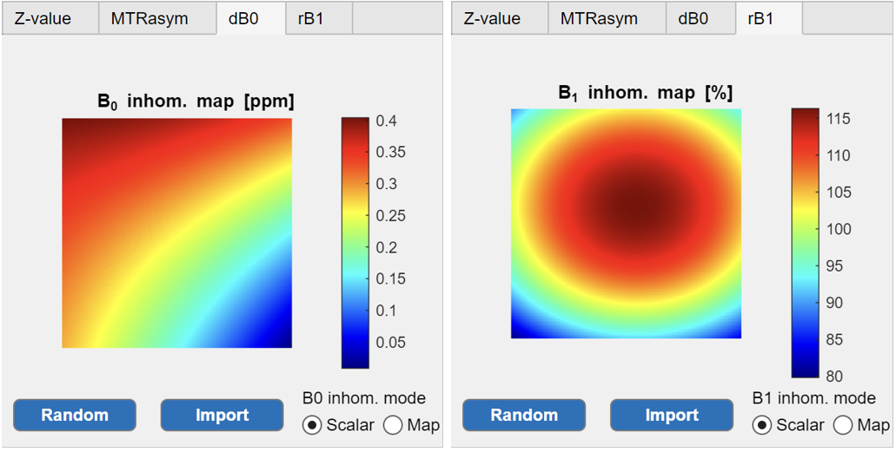
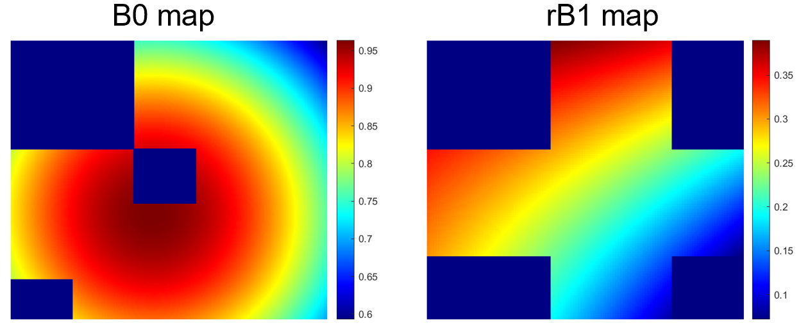

example configuration files used in CESTsimu (please refer to the reproduction folder for CESTsimu data post-processing code)

## BMsimchallenge

source: https://github.com/pulseq-cest/BMsim_challenge

files: 

- .seq: primarily defines saturation sequence
- .yaml: primarily defines exchange pool

| Case | saturation    | B1    | Tsat | pool    | n_pulse | RF phase |
| ---- | ------------- | ----- | ---- | ------- | ------- | -------- |
| 1    | CW            | 2uT   | 15s  | 2 pools | 1       | no       |
| 2    | CW            | 2uT   | 2s   | 2 pools | 1       | no       |
| 3    | CW            | 2uT   | 2s   | 5 pools | 1       | no       |
| 4    | CW            | 3.7uT | 5ms  | 5 pools | 1       | no       |
| 5    | Gaussian-50ms | 2uT   | 50ms | 2 pools | 1       | no       |
| 6    | Gaussian-50ms | 2uT   | 2s   | 2 pools | 36      | yes      |
| 7    | Gaussian-50ms | 2uT   | 2s   | 5 pools | 36      | yes      |
| 8    | CW (WASABI)   | 3.7uT | 10ms | 5 pools | 2       | yes      |

## 1D-Zspectra

- Default.excpara: five exchange pools (DS, MT, Amide@3.5ppm, NOE@-3.5ppm, guan@2.0ppm)
- Default.satpara: 0.8 uT, 2 s continuous wave (CW)
- WASABI_loadoffs.satpara: 3.7 uT, 5 ms CW
- PulseCEST_Sinc.satpara: 0.8 uT, 100 ms Sinc (n=20)
- PulsedCEST_loadRF.satpara: 0.8 uT, 100 ms Gauss (n=20)
  - Gauss pulse loaded from rf_pulse.txt
- PulsedCEST_loadRF_loadoffs.satpara: 0.8 uT, 100 ms Gauss (n=20)
  - Gauss pulse loaded from rf_pulse.txt
  - offset list loaded from offsList.txt
- rf_pulse.txt: Gauss pulse in BMsim challenge case 5 (https://github.com/pulseq-cest/BMsim_challenge/tree/main/case_5)
- offsList.txt: 43 offset ranging from -20 ppm to 20 ppm (from -4 ppm to 4 ppm in 0.25 ppm steps)

## 2D-Phantom

- CW0.8uT_Amide_NOE_f.mat (.xlsx): concentration (Amide) from 0 mM to 500 mM, concentration (NOE) from 0 mM to 500 mM.
- CW0.8uT_Water_T2T1.mat (.xlsx): T1 (water) from 0.6 s to 3.8 s, T2 (water) from 40 ms to 150 ms

## 2D-B0/B1maps

- CESTsimudata_WASABI-2D.mat: T1 (water) from 0.6 s to 3.8 s, B0/rB1 maps as follows

- B0B1map_mask.mat: B0 and B1 maps with mask (store as `B0map` and `B1map` respectively).

