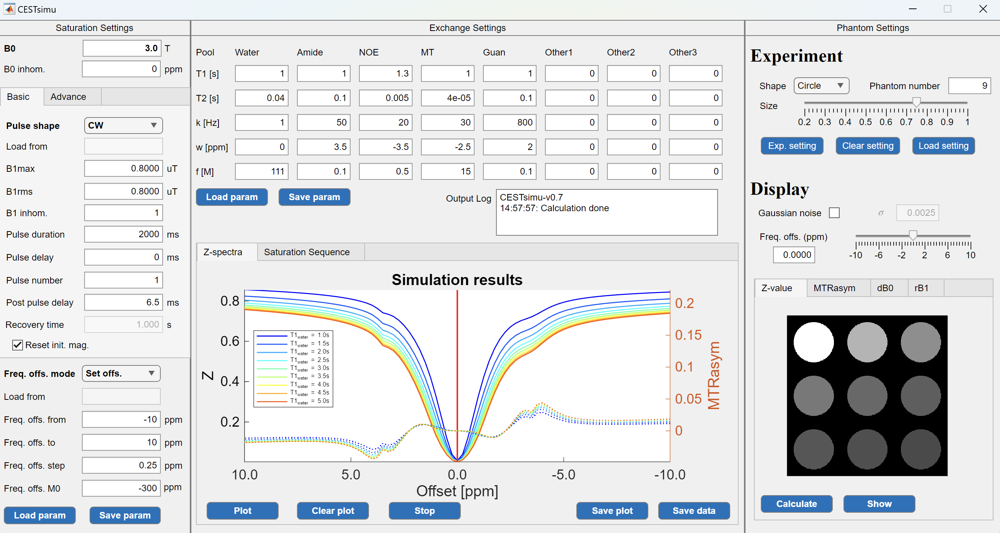
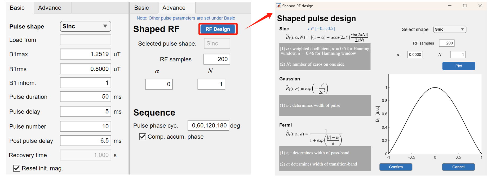
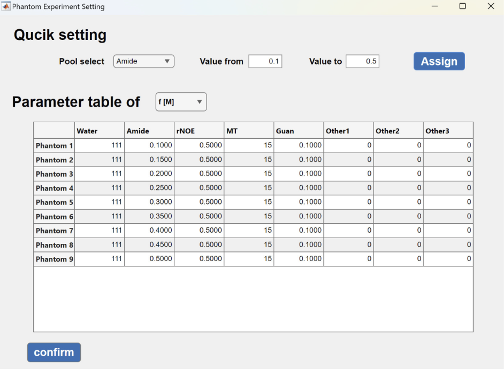
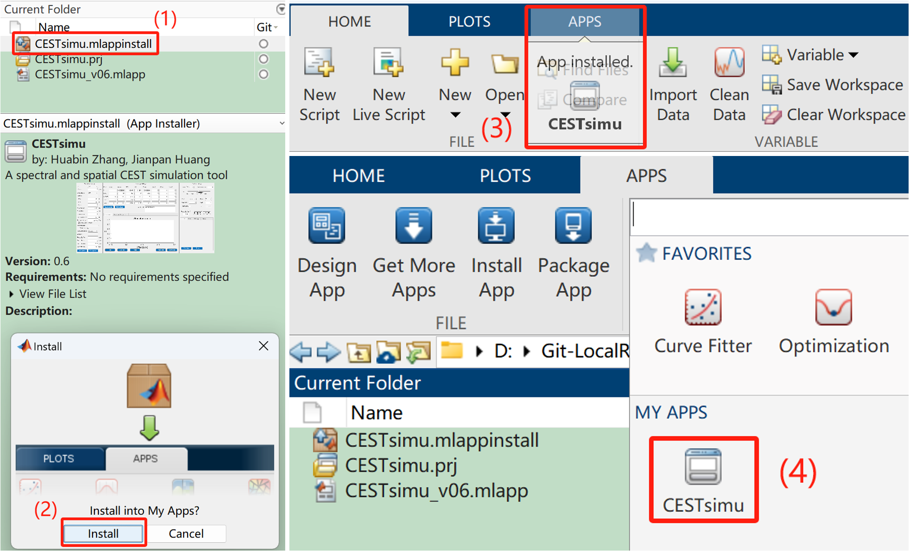
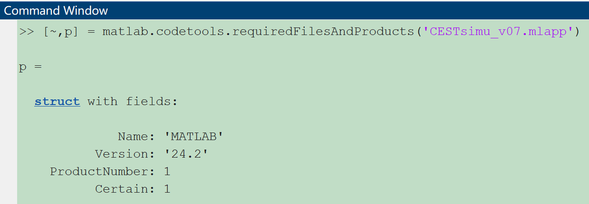
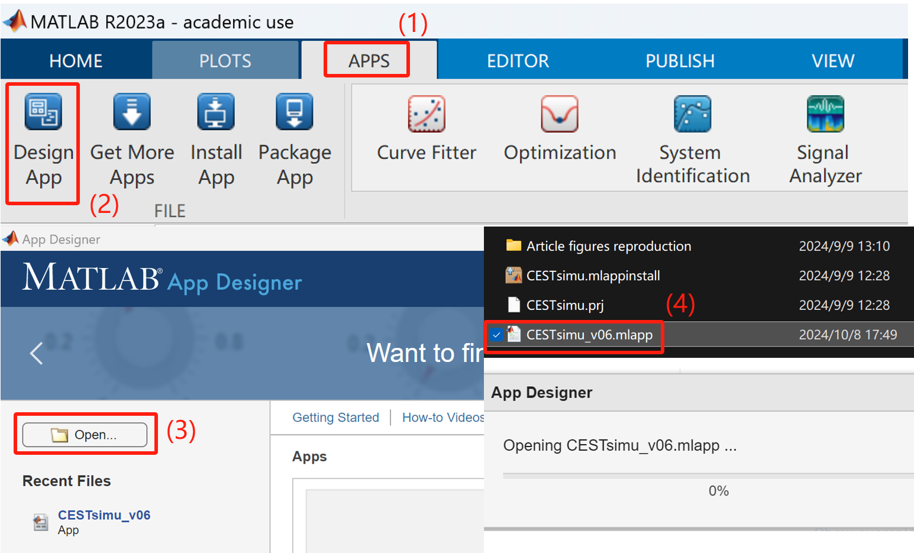
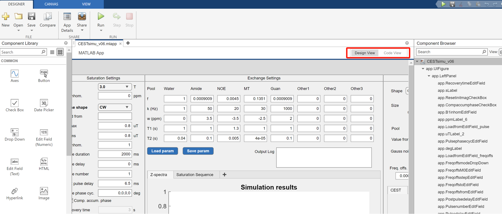
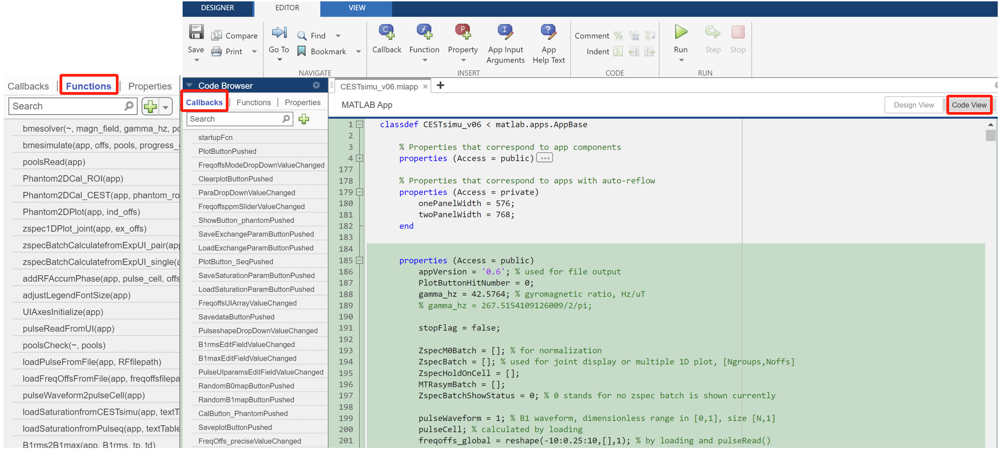

# CESTsimu
A spectral and spatial CEST simulation tool

## Layout

Overall layout of CESTsimu

Extend RF design window (added in CESTsimu v07)

2D phantom experiment setting window (added in CESTsimu v07)

## Abstract

**CESTsimu** is a CEST simulation tool with a GUI for intuitively simulating spectral (1D Z-spectra) and spatial (2D phantom) data. CESTsimu has potential to broaden the utilization of CEST MRI among diverse users. It consists of three modules: **Saturation settings**, **Exchange settings**, and **Phantom settings**. CESTsimu can not only import/export files in the defined format but can also import files generated by other existing simulation platform (pulseq-CEST). CESTsimu has potential to facilitate the broad utilization of CEST MRI among diverse users.

## Installation and use

- CESTsimu is developed using MATLAB 2024b, so if your version of MATLAB is earlier than 2024b, try update your MATLAB when encountering problems.
- In MATLAB, navigate to the CESTsimu folder, open **CESTsimu.mlappinstall** and install. Then you will find CESTsimu in the "Apps" tab, in the "My apps" group. Click on it to execute the app.

## Toolbox dependency

No additional MATLAB toolbox (e.g., Signal Processing Toolbox) is required for CESTsimu.

## Customizing CESTsimu

The source code of the CESTsimu is uploaded and named as `CESTsimu_vxx.mlapp`. You can customize the GUI using the **MATLAB App Designer**.

First open the .MLAPP file using the **MATLAB App Designer**, as follow:

Then you can modify the UI component in the **Design View**.

You can also switch to the **Code View**, and modify the Functions or the Callbacks.

