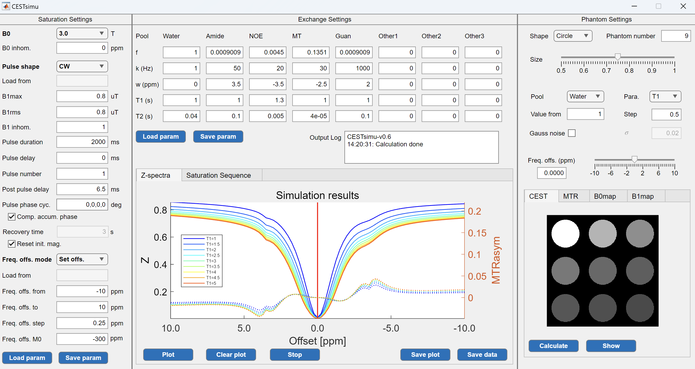
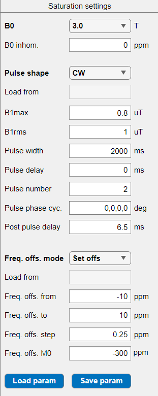
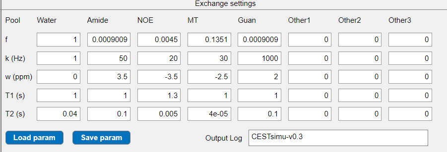
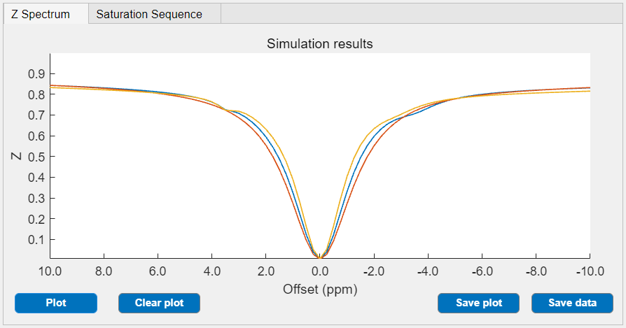
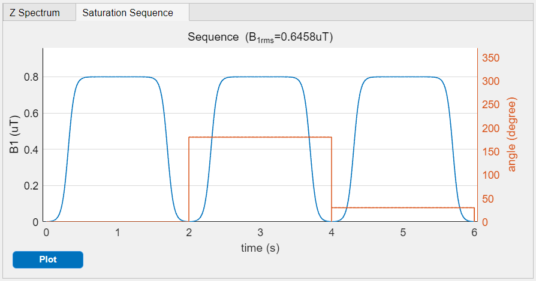
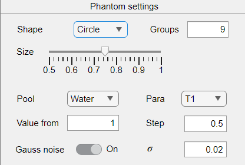
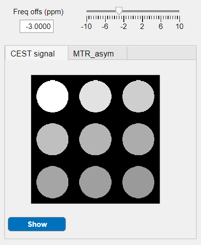
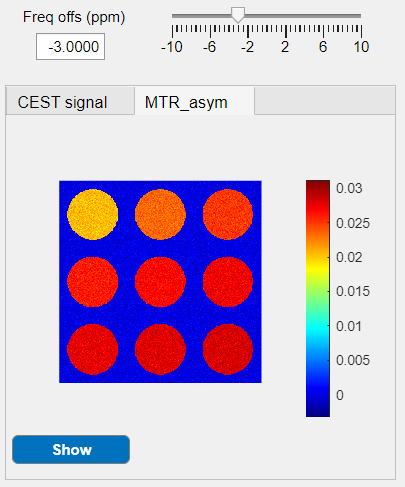
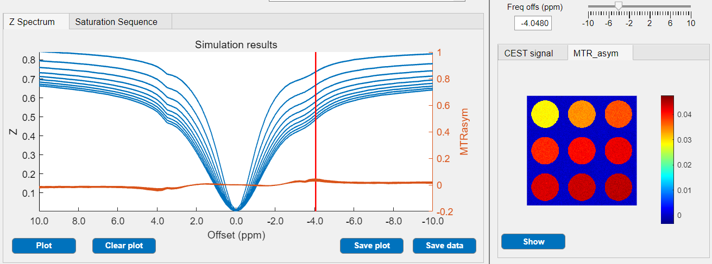

# CESTsimu APP

## 1. Introduction

### 1.1 Software Overview

The CESTsimu app is a user interface software designed for CEST data simulation. It utilizes an integrated Bloch-McConnell Equation (BME) solver to calculate CEST data under various saturation and exchange pools settings. The app allows users to generate customized 2D phantom image data, facilitating the validation of post-processing techniques for CEST. Additionally, it supports the import of open-source framework [pulseq-cest](https://pulseq-cest.github.io/) input files.

### 1.2 Overview of the User Interface



The user interface of the CESTsimu app comprises three main components:

- Saturation settings: configure parameters of B0, B1 pulse, and frequency offsets.
- Exchange settings: configure exchange pools, plot Z-spectrum curves, and plot sequence diagrams for saturation module.
- Phantom settings: configure phantom shape, plot CEST images of phantoms.

### 1.3 Installation and Configuration

The CESTsimu app is developed on the App designer of MATLAB R2023a. The installation of the CESTsimu app can be referenced from the MATLAB official documentation - [Get and Create Apps](https://ww2.mathworks.cn/help/matlab/creating_guis/apps-overview.html?requestedDomain=en).


## 2. Getting Started

### 2.1 Saturation Settings

This panel is to configure the saturation parameters for CEST simulation.



#### 2.1.1 Scanner Settings

The scanner properties are defined using following parameters:

- B0: magnetic field strength [T], only discrete values in the dropdown box are supported
- B0_inhomo: B0 field inhomogeneity [ppm]

#### 2.1.2 Pulse Settings

The saturation module is defined by the repeated combination of individual pulse waveforms, shown as bellow.

```matlab
% sequence: [pulse, delay] -> [pulse, delay] -> ... -> tpost -> acquisition
%            \_______________________________________/
%                     repeat Pulse number times
```

Several parameters in the UI have to be defined:

- Pulse shape: the shape of the individual pulse waveform
  - CW: continuous wave with constant magnitude
  - Sinc: shape of sinc function
  - Gauss: shape of Gaussian function
  - Fermi: shape of Fermi function
  - Other: other shape from loaded files
- B1max: maximum pulse magnitude [uT], linked with B1rms
- B1rms: root mean square pulse magnitude [uT], linked with B1max
  - calculated using $B_{1rms}=B_{1,max}\sqrt{\frac{1}{t_p+t_d}\int_0^{t_p} [B_{1,uni}(t)]^2 dt}$
- Pulse width: individual pulse duration [ms], noted as tp
- Pulse delay: inter-pulse delay between pulses [ms], noted as td
- Pulse number: repeat times of the individual pulse
- Pulse phase cyc.: phase cycle pattern of repeated pulse [deg]
  - e.g.,`[0,30,60]` represents a phase offset of `[0,30,60,0,30,...]`
- Post pulse delay: time delay between saturation pulses and acquisition [ms]

#### 2.1.3 Frequency Offset Settings

The measured frequency offsets are defined by linearly spaced vector or input files. A customized non-linearly spaced offsets array can only be defined by manually editing the external file and loading it. 

The M0 offset is defined independent from the frequency offset array, and will not be plotted on the Z-spectrum figure. The CEST phantom image at M0 offset will be exported as individual variable.

Several parameters in the UI have to be defined:

- Freq. offs. mode: frequency offset define mode
  - Set offs: defined as linearly spaced vector using UI parameters
  - Load offs: defined from loaded files
- Freq. offs. from: starting value of the linearly spaced array [ppm]
- Freq. offs. to: ending value of the linearly spaced array [ppm]
- Freq. offs .step: step of the linearly spaced array [ppm]
- Freq. offs. M0: m0 offset [ppm]

### 2.2 Exchange Settings

This panel is to configure exchange pools parameters for simulation, and plot 1D curves of the Z-spectrum and defined saturation sequence.

#### 2.2.1 Pools Settings

The CESTsimu app supports simulation of up to eight-pools model. Pools with zero T1 or T2 value will be ignored in the calculation. Each pool is defined using following parameters:

- f: the relative proton fraction, usually defined as 1 for the water pool
- k: the exchange rate to the water pool [Hz]
- w: the chemical shift relative to water [ppm]
- T1: the longitudinal relaxation time [s]
- T2: the transversal relaxation time [s]



#### 2.2.2 Z-spectrum Plot

The calculated Z-spectrum $Z(\Delta\omega)=S(\Delta\omega)/S(\Delta\omega_{M0})$ will be plotted here after clicking the `Plot` button. The `x` axis is the defined frequency offsets array, and the `y` axis is the calculated Z value normalized by signal at M0 offset. The range of the `x` axis is consistent with the current frequency offsets array.

The Z-spectrum plot is set to **hold on** mode, and subsequent curve will be added to the figure if the `Plot` button is clicked again. All plot will be cleared when the `Clear plot` button is clicked.



#### 2.2.3 Saturation Sequence Plot

The currently UI-defined saturation module will be plotted here after clicking the `Plot` button. The `x` axis is the time coordinate of the saturation sequence, the left `y` axis is the pulse magnitude (in uT), and the right `y` axis is the pulse phase (in degree). The calculated B1rms will be shown at the title.



### 2.3 Phantom Settings

This panel is to configure phantom experiment parameters, and plot 2D images. User can conduct comparative experiment on a single variable of a exchange pool (e.g., T1 value of the water pool) by defining linearly varied values.

#### 2.3.1 Experiment Settings

The 2D phantom image is defined by the following parameters:

- Shape: shape of phantom, three options are provided (Circle, Square, Triangle)
- Groups: number of experimented variable values, same as the number of phantoms to be plotted
- Size: relative radius of the phantom, ranging from 0.5 to 1
- Pool: the experimented exchange pool name
- Para: the experimented variable
- Value from: starting value of the experimented variable array
- Step: step of the experimented variable array
- Gauss noise: switch button for noise addition
- $\sigma$: standard deviation of the normal distribution



#### 2.3.2 Phantom Image Plot

The simulated 2D phantom images with defined noise will be plotted here after clicking the `Show` button. Images at different frequency offset can be adjusted by either the slider or the input box. The magnitude of the shown phantom images for a given frequency offset is calculated analytically regardless of the defined frequency offsets array in the `Saturation settings` panel.

Magnitude of images at the `CEST signal` tab is calculated using $I(\Delta\omega)=Z(\Delta\omega)+Noise$.



Magnitude of images at the `MTR_asym` tab is calculated using $I(\Delta\omega)=Z(-\Delta\omega)-Z(\Delta\omega)+Noise$, and is shown with `jet` color map.



#### 2.3.3 Joint Z-spectrum Plot

If the 2D phantom images are shown, corresponding Z-spectrum MTR_asym curves will be plotted in the `Exchange settings` panel. The left `y` axis is the calculated Z value normalized by signal at M0 offset, and the right `y` axis is the calculated MTR_asym value. The bold red line represents the frequency offset of the current plotted 2D phantom image.




## 3 File Import and Export

### 3.1 Saturation File

The file import and export of the `Saturation settings` involve following situations:

- `Pulse shape` set to `Other`: import individual pulse from `.satpara`, `.txt`
- `Freq. offs. mode` set to `Load offs`: import frequency offsets array from `.satpara`, `.seq`
- Click `Load param` button: import all saturation settings from `.satpara`, `.seq`
- Click `Save param` button: export all saturation settings to `.satpara`

#### 3.1.1 satpara File

The CESTsimu app can solely import either individual pulse waveform or frequency offsets array from the well-defined `.satpara` file. 

The `.satpara` file defined by the CESTsimu app is written in the following format. The individual pulse's waveform is stored as normalized digit ranging from 0 to 1. Text in the `.satpara` file is consistent with the values shown in the UI.

```

============= CESTsimu, version 0.3 =========
Generate date: 2024-04-10 10:01:20

#=============== B0 info ====================         
B0 (T)                 :       3.0
B0 inhomogeneity  (ppm):         0
                                  
#=============== Frequency offsets ==========         
Freq. offset mod       :  Set offs
Freq. offset M0   (ppm):      -300
Freq. offset from (ppm):       -10
Freq. offset to   (ppm):        10
Freq. offset step (ppm):      0.25
                                  
#=============== Pulse info =================         
Post pulse delay(ms)   :       6.5
Shape                  :        CW
B1_max (uT)            :       0.8
B1_rms (uT)            :         1
Pulse width (ms)       :      2000
Pulse gap (ms)         :         0
Pulse repeat           :         2
Pulse phase cycle (deg):   0,0,0,0
                                  
#=============== Pulse waveform ===========         
# num_samples 1
1
```

#### 3.1.2 seq File

The CESTsimu app can import saturation settings and frequency offsets array from a `.seq` file defined by the open-source framwork [pulseq](https://pulseq.github.io/) and [pulseq-cest](https://pulseq-cest.github.io/). 

It should be noticed that, only the text in the `[DEFINITIONS]` block will be imported, and the CESTsimu app is not capable to load individual pulse waveform from the `.seq` file. Hence an additional manual import is needed when dealing with shaped-pulse.


#### 3.1.3 txt File (for Pulse Shape)

The CESTsimu app can readily load pulse waveform from a structured `.txt` file. The last column will be recognized as pulse magnitude if multiple columns exist. A supportable `.txt` file format for pulse waveform loading is listed below, which is a Gaussian pulse shape provided by [BMsim_challenge Case 7](https://github.com/pulseq-cest/BMsim_challenge/tree/main/case_7).

```
0.000125	0.49835002035445825
0.000375	1.5100506512732437
0.000625	2.5419648068662166
0.000875	3.594353937897367
0.001125	4.667484883892529
0.001375	5.761627953830904
0.001625	6.877054927853293
0.001875	8.014036986445126
0.002125	9.172842573871385
0.002375	10.353735202940463
......
```


### 3.2 Exchange Pools File

The file import and export of the `Exchange settings` involve following situations:

- Click `Load param` button: import all saturation settings from `.excpara`, `.yml`
- Click `Save param` button: export all saturation settings to `.excpara`

#### 3.2.1 excpara File

The `.excpara` file defined by the CESTsimu app is written in the following format. Text in the `.excpara` file is consistent with the names shown in the UI.

```

======== CESTsimu, version 0.3 =========
Generate date: 2024-04-10 10:27:15

#========= Exchange pools info =========
Pool          ,   Water,       Amide,      NOE,       Mt,        Guan,   Other1,   Other2,   Other3
fraction (0~1),       1,   0.0009009,   0.0045,   0.1351,   0.0009009,        0,        0,        0
Exch Rate (Hz),       1,          50,       20,       30,        1000,        0,        0,        0
dw (ppm)      ,       0,         3.5,     -3.5,     -2.5,           2,        0,        0,        0
T1 (s)        ,       1,           1,      1.3,        1,           1,        0,        0,        0
T2 (s)        ,    0.04,         0.1,    0.005,    4e-05,         0.1,        0,        0,        0
```


#### 3.2.2 yaml File

The CESTsimu app can import exchange pools settings from a `.yml` file defined by [pulseq-cest](https://pulseq-cest.github.io/). Pools with unrecognized name will be imported as `Other` pool. Up to three `Other` pools are supported, and exceeding pools will be discarded. Only text related to pools settings will be imported.

A supportable `.yml` file format for exchange pools loading is listed below, which is provided by [BMsim_challenge Case 7](https://github.com/pulseq-cest/BMsim_challenge/tree/main/case_7).

```yaml
# water pool
water_pool: { f: 1.0, t1: 1.0, t2: 0.040 }

# CEST, NOE, MT pools
cest_pool:
  {
    "amide": { f: 0.0009009, t1: 1.0, t2: 0.1, k: 50, dw: 3.5 },
    "guanidine_1": { f: 0.0009009, t1: 1.0, t2: 0.1, k: 1000, dw: 2 },
    "NOE_1": { f: 0.0045, t1: 1.3, t2: 0.005, k: 20, dw: -3 },
    "MT": { f: 0.1351, t1: 1.0, t2: 4.0e-05, k: 30, dw: -3.0 },
  }
```


### 3.3 CESTsimu Data File

The CESTsimu will save all simulation data as `.mat` file after clicking the `Save data` button in the `Exchange settings` panel. The exported variables in the `.mat` file are listed below:

- offs: frequency offsets array, size [Nf,1]
- img: 2D phantom images with Z value (before M0 normalization), size [Nx,Ny,Nf]
- img_MTR: 2D phantom images with MTR_asym value (calculated analytically instead of interpolation), size [Nx,Ny,Nf]
- img_m0: 2D phantom images with Z value at M0 offset, size [Nx,Ny]
- img_roi: 2D phantom image mask, size [Nx,Ny]
- datainfo: simulation information, including saturation settings, exchange pools settings, and experiment settings
